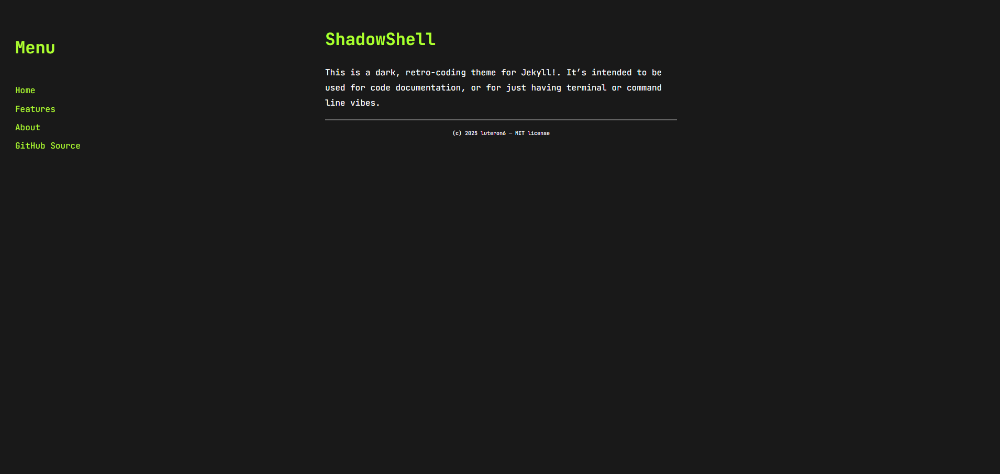

# ShadowShell
**ShadowShell** is a dark, retro-coding theme for Jekyll. It’s intended to be used for code documentation, or for just having terminal or command line vibes.

<p align="center">
  
</p>

## Features

### Menu
The menu on the left can be customized to contain any links.

### Headers
Headers 1-3 are neon green like above. Headers 4 and smaller headers are white.


### Code Blocks:
Code blocks have a light grey bubble around them. They use Rouge for syntax highlighting and look awesome. <br><br>
Here's some Python:

```python
print("Hello, world!")
for i in range(10):
    print(i)
```
And here's some HTML:

```html
<h1>Hello, world!</h1>
<p>This is lovely.</p>
```
### Links
Links are also neon green <a href="#links"> like this:</a>. They turn neon blue when hovered over or clicked.

### Lists
#### Bulleted Lists
- These are bulleted lists.
- They look great.

- You can even nest them.
  - Like this.
  - Or this.

#### Numbered Lists
1. These are numbered lists.
2. They look great.
3. You can even nest them.
   1. Like this.
   2. Or this.


### Blockquotes
> "Never throughout history has a man who lived a life of ease left a name worth remembering."<br>~ Theodore Roosevelt

## installation
#### GitHub Pages
if your site is hosted on GitHub Pages, you can add lifeblood to your site's `_config.yml` as a remote theme:

```yml
remote_theme: luteron6/tonic-template
```
#### Advanced
`git clone` this repo to have a local installation. Run `gem install jekyll`, then `jekyll serve` to see the template in action.

Made with ❤️ by a hackclubber for the YSWS [#tonic](tonic.hackclub.com)